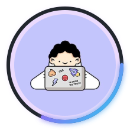
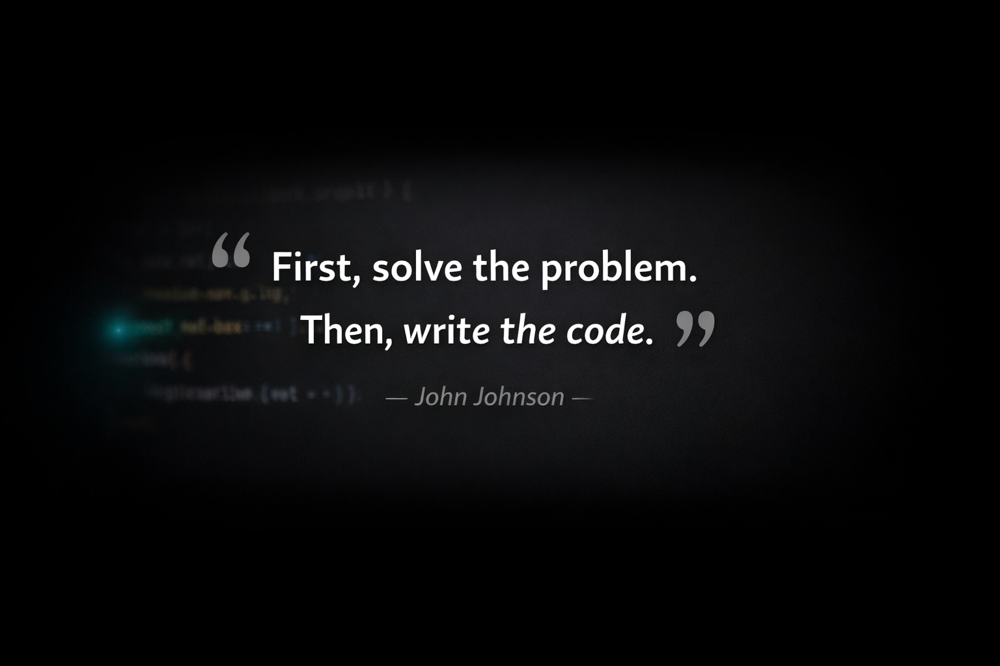

<div align="center">

<picture>
  <source media="(prefers-color-scheme: dark)" srcset="./dark.svg">
  <source media="(prefers-color-scheme: light)" srcset="./light.svg">
  
</picture>

<br>

<!-- ═══ PROFILE AVATAR ═══ -->


<br>

<!-- ═══ INTRO TYPING SVG ═══ -->


<br><br>

<!-- ═══ SOCIAL ICONS ═══ -->
<a href="https://linkedin.com/in/amos-nganbe" target="_blank">
  
</a>
<a href="mailto:nganbewuborijaamos@gmail.com">
  
</a>
<a href="https://instagram.com/famous_graphics0" target="_blank">
  
</a>
<a href="https://github.com/FAMOUS223-hub" target="_blank">
  
</a>

<br>

<!-- ═══ STATUS ═══ -->


</div>

<br>

---

<br>

## 👨‍💻 &nbsp;Who Am I?

```
┌──────────────────────────────────────────────────────────────────────┐
│                                                                      │
│   Hello! I'm Amos Wuborija Nganbe — a creative technologist         │
│   based in Accra, Ghana 🇬🇭.                                        │
│                                                                      │
│   With 5+ years in graphic design (Adobe Suite, Canva) and a        │
│   growing command of web technologies, I sit at the intersection     │
│   of visual craft and software engineering.                          │
│                                                                      │
│   I build responsive, accessible web experiences and design          │
│   systems that bridge the gap between aesthetics and functionality.  │
│                                                                      │
│   Currently leveling up in JavaScript, React, and backend            │
│   development to become a well-rounded full stack engineer.          │
│                                                                      │
└──────────────────────────────────────────────────────────────────────┘
```

<br>

---

<br>

## 🔥 &nbsp;What I'm Working On

<table>
<tr>
<td width="50%" valign="top">

### 🚀 Currently
- 🔭 Building full stack projects with **React** & **Node.js**
- 🌱 Learning **backend development** & **database design**
- 💡 Exploring **AI/ML** integrations for creative tools
- 🎨 Designing UI/UX for web & mobile applications

</td>
<td width="50%" valign="top">

### 🎯 Goals
- 🏆 Land a **Full Stack Developer** role
- 🌍 Contribute to **open source** projects
- 📚 Master **TypeScript**, **Next.js**, & **PostgreSQL**
- 🤝 Build products that solve real-world problems

</td>
</tr>
</table>

<br>

---

<br>

## 🛠️ &nbsp;Tech Stack

<div align="center">

### Frontend


### Languages


### Design & Creative


### Tools & Platforms


</div>

<br>

---

<br>

## 📊 &nbsp;GitHub Stats

<div align="center">


<br><br>


</div>

<br>

---

<br>

## 🐍 &nbsp;Contribution Graph

<div align="center">


</div>

<br>

---

<br>

## 💡 &nbsp;Random Dev Quote

<div align="center">
<p align="center">
  
</p>
</div>

<br>

---

<br>

## 🌟 &nbsp;Featured Projects

<table>
<tr>
<td align="center" width="33%">

#### 📁 Project One
*Coming Soon*
<br>


</td>
<td align="center" width="33%">

#### 📁 Project Two
*Coming Soon*
<br>


</td>
<td align="center" width="33%">

#### 📁 Project Three
*Coming Soon*
<br>


</td>
</tr>
</table>

<br>

---

<br>

## ⚡ &nbsp;Fun Facts

<div align="center">

```bash
$ cat /etc/fun-facts
```

| | |
|---|---|
| 🎨 | I've designed **500+** graphics across social media campaigns |
| 💻 | First line of code: `Hello, World!` in Java — and I was hooked |
| 🌍 | I believe in **code without borders** — open to remote opportunities worldwide |
| ☕ | Debugging at 2AM runs on pure determination (and caffeine) |
| 🎯 | Currently on a mission to bridge the gap between **design & development** |

</div>

<br>

---

<br>

<div align="center">

### 💬 &nbsp;*"The best interface is no interface — until you build one so good it feels invisible."*

<br>


<br><br>

**Built with 💜 by Amos** &nbsp;|&nbsp; *Always learning. Always shipping.*

<br>


</div>
